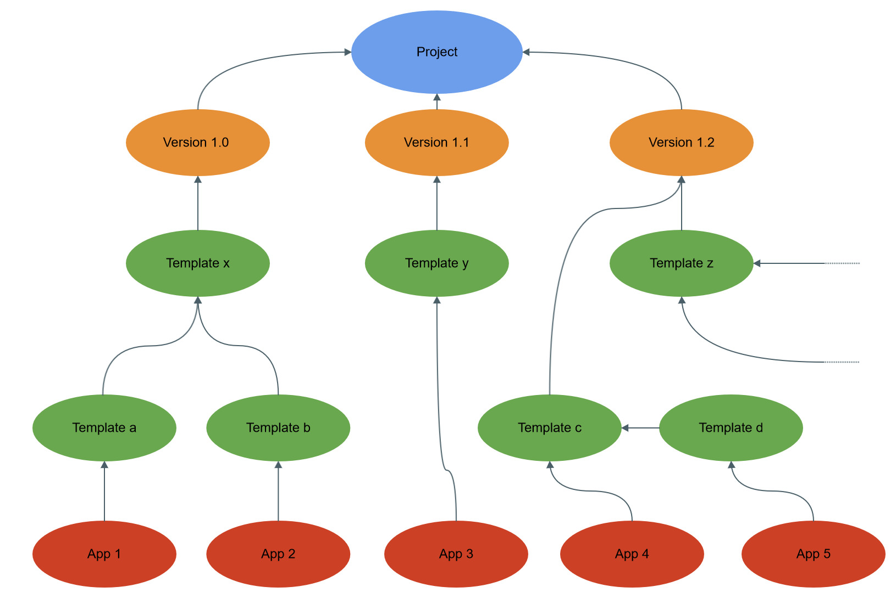
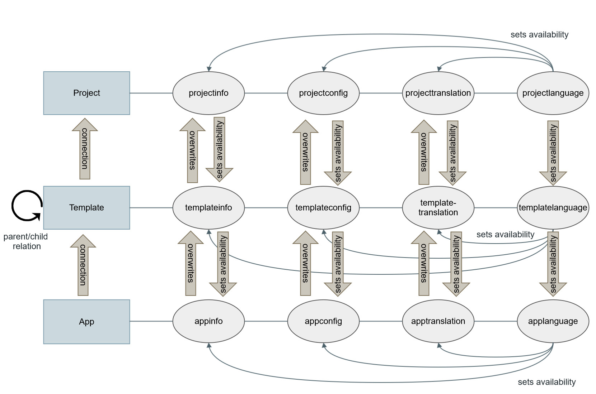

API - Data structure
====================

*App-Arena.com apps launched in the world wide web are designed to be highly customizable. Through a system of interconnected configuration sets,
we make sure that every customer is able to make his app look and feel like a unique and individually crafted application.*

In order to create new apps it is crucial to know the mechanics working in the background.

The components of an application
--------------------------------

Every App-Arena.com application consists of three types of components:

    - projects
    - templates
    - apps

All of these components are build up in the same way, consisting of a config, an info, a translation and a language section

+------------+------------------------------+-----------------------------------+
| Component  | Component section            | Route                             |
+============+==============================+===================================+
| project    | projectconfig                | /projects/:projectId/config       |
|            | projectinfo                  | /projects/:projectId/info         |
|            | projecttranslation           | /projects/:projectId/translation  |
|            | projectlanguage              | /projects/:projectId/language     |
+------------+------------------------------+-----------------------------------+
| template   | templateconfig               | /templates/:templateId/config     |
|            | templateinfo                 | /templates/:templateId/info       |
|            | templatetranslation          | /templates/:templateId/translation|
|            | templatelanguage             | /templates/:templateId/language   |
+------------+------------------------------+-----------------------------------+
| app        | appconfig                    | /apps/:appId/language             |
|            | appinfo                      | /apps/:appId/language             |
|            | apptranslation               | /apps/:appId/language             |
|            | applanguage                  | /apps/:appId/language             |
+------------+------------------------------+-----------------------------------+

The requests to access the resources contained in the components are explained in their respective chapters.

The project
~~~~~~~~~~~

At the foundation of every application is a project. Projects serve as the central entry point for a collection of version varieties, which
occur over the course of a development. Every version contains the necessary settings and information an application needs to operate, from configuration entries which define fundamental
application functionality to information entries framing it in its web context. Translations are found there as well as the languages in which the project
is available.

.. Note:: The distinctive versions of a project hold the entirety of customization options, hence defining the palette of available items.

The template
~~~~~~~~~~~~

In order to customize an application to their individual purpose there are configuration sets which can overwrite the default values contained in the root project.

On our platform, we call these configuration sets 'templates'. Templates can contain as little as a single configuration but may as well be used to configure, style and translate
an entire application. However, the real power of the templates derives from the possibility to chain them together and thus, let you create vast amounts of apps of individual
behaviour with minimal effort.

The app
~~~~~~~

Projects and templates are the space in which the designers of an application operate. The app however is the place where the customers have the power to make their application look and feel
the way they want it.

.. Note:: While templates mostly contain general configurations altering the core functionality of the project version, the app domain is used for storing what makes the application unique.

An example
~~~~~~~~~~

To clarify this concept, imagine a contest project in its initial version "1.0". It contains the logic necessary to let users pick a single item of their preference out of a greater heap of related items.
These items can be anything from a picture or a video to a song, the core of the voting system stays the same, no matter what is being voted for. The difference between
the contest modes is determined through the configuration sets, which 'shape' the project to the customers needs.

We could create a template which 'shapes' the contest-project to a video contest by altering the configuration accordingly. In the next step, we create three templates
which alter the Headline to 'Band-Contest', 'Beauty-Contest' and 'Funny-Video-Contest' as well as setting the logos adequately. These templates now get chained to the template we
created in the first place by declaring them as children of it.

This results in three different apps with individual look and feel while the core logic behind them stays the same. The customers now get a web interface in which they can choose the font, the
colors of their corporate design and the content e.g. the text to be displayed after a user casted a vote for an item.

Should the developers of this contest project come up with new ideas and features, they can easily create a new version of the project (in this example it would be version "1.1"), copying
whatever they want to adopt from the initial version to the newly created one. The new version can now be enhanced with new configurations and content while apps pointing to version "1.0"
still work without restriction.

In image 1, the relation between 'apps', 'templates' and 'projects' is illustrated.

As seen in image 1, all versions point to their root project. Templates however can point to a project version as well as to a another template. The difference is determined by
the parentId: If the parentId points to itself, or in other words, if the parentId equals the templateId, the template points to the project version declared in it. In the case that
templateId and parentId differ, the template points to its parent template.

Templates may only contain settings that are already present in the project version. They are therefore only capable of overwriting existing settings and do not create configurations on their
own. Besides other crucial information, the app itself holds a set of configurations as well, making it a mixture between a template and additional customization options. The app is mostly
the customers domain where he can give the application his final personal touch.

Projects, templates and app settings are hierarchically structured. This means that settings in the app overwrite occurrences of the same setting from templates and the project. Likewise
template settings overwrite those of the parent template and project. Image 2 shows this behaviour.

The image shows how the different types of settings found in projects/templates/apps:

    - info:         Works as a key => value storage for general application information like e.g. domain name, facebook ID, app validity in days, ...
    - config:       Is used to configure the application itself like e.g. font, logo uri, images, html and css code, ... The different types of config values are categorized. See the different types of config values and their characteristics `here <../api/060-config.html>`_.
    - translation:  Stores the translation strings used for multi language support.
    - language:     Sets the available/activated languages.

The hierarchy of the distinct sections lead to some basic rules in the design of an application:
The project version dictates the range of configs, infos and languages available for templates and apps pointing to it. Templates and apps can therefore
overwrite (by PUT request) configs, infos and translations in languages present in the project. New entries can only be created in the project itself, which explains
the absence of POST request for the respective sections.
Slightly different is the behaviour for the available languages. While it is possible to edit configs, infos and translations, for templates and apps

